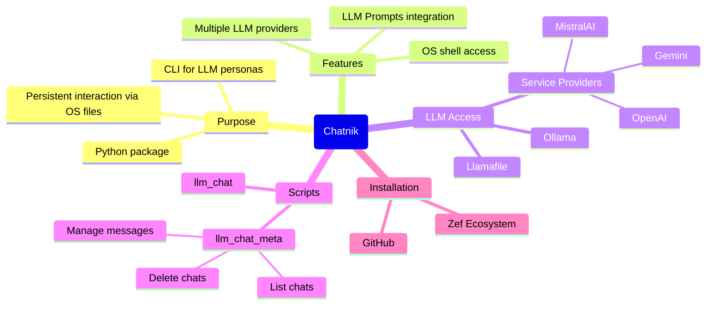
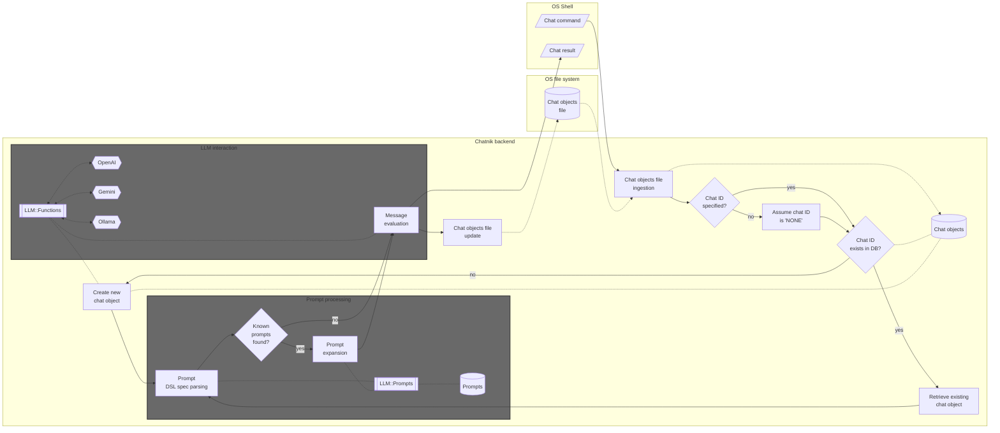
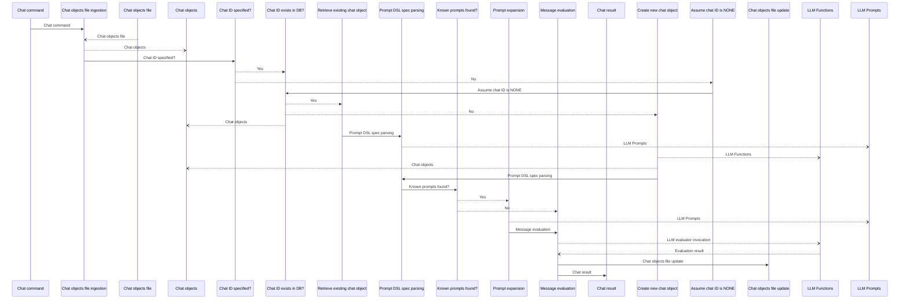

# Chatnik

Python package that provides Command Line Interface (CLI) scripts for conversing with persistent Large Language Model (LLM) personas.

"Chatnik" uses files of the host Operating System (OS) to maintain persistent interaction with multiple LLM chat objects.

"Chatnik" can be seen as a package that "moves" the LLM-chat objects interaction system of the Python package ["JupyterChatbook"](https://github.com/antononcube/Python-JupyterChatbook), [AAp3], 
into typical OS shell interaction.
(I.e. an OS shell is used instead of a Jupyter notebook.) 

There are several consequences of this approach:

- Multiple LLMs and LLM providers can be used
- The chat messages can use the provided by the package ["LLMPrompts"](https://github.com/antononcube/Python-packages/LLMPrompts), [AAp2]:
  - Prompts collection
  - Prompt spec DSL and related prompt expansion
- Easy access to OS shell functionalities 

**Remark:** This Python package is a translation of the Raku package ["Chatnik"](https://github.com/antononcube/Raku-Chatnik), [AAp4].
The corresponding CLI scripts of the Raku package use kebab-case, i.e. `llm-chat` and `llm-chat-meta`.
In addition, the Raku package provides the "umbrella" CLI `chatnik`.

----

## Installation

From [PyPI.org](https://pypi.org/project/Chatnik):

```
pip3 install Chatnik
```

From GitHub:

```
pip install -e git+https://github.com/antononcube/Python-Chatnik.git#egg=Python-Chatnik
```

----

## LLM access setup

There are several options for using LLMs with this package:

- Install and run [Ollama](https://ollama.com)
- Run a [llamafile / LLaMA model](https://github.com/mozilla-ai/llamafile)
- Have programmatic access to LLMs of service providers like [OpenAI](https://developers.openai.com/api/docs/models) or [Gemini](https://ai.google.dev/gemini-api/docs/models)
- For the corresponding setup see ["LLMFunctionObjects"](), [AAp1]


----

## Basic usage examples

The prompts used in the examples are provided by the Python package "LLMPrompts", [AAp2].
Since many of the prompts of that package have dedicated pages at the [Wolfram Prompt Repository (WPR)](https://resources.wolframcloud.com/PromptRepository/)
the examples use WPR reference links.

### A few turns chat

The script `llm_chat` is used to create and chat with LLM personas (chat objects):

1. Create _and_ chat with an LLM persona named "yoda1" (using the [Yoda chat persona](https://resources.wolframcloud.com/PromptRepository/resources/Yoda/)):

```shell
llm_chat -i=yoda1 --prompt @Yoda hi who are you
```
```
# Yoda, I am. Jedi Master, wise and old. Help you, I can. What seek you, hmm?
```

2. Continue the conversation with "yoda1":

```shell
llm_chat -i=yoda1 since when do you use a green light saber
```
```
# Green, my lightsaber is. Symbol of a Jedi Consular, it is. Wisdom and harmony, it represents. Since many years, I have wielded it. Strong in the Force, I am. Use the Force, you must, young one.
```

**Remark:** The message input for `llm_chat` can be given in quotes. For example: `llm_chat 'Hi, again!' -i=yoda1`.

**Remark:** The script `chatnik` can be used instead of `llm_chat`.

### Apply prompt(s) to shell pipeline output

Summarize a file using the prompt ["Summarize"](https://resources.wolframcloud.com/PromptRepository/resources/Summarize):

```shell
cat README.md | llm_chat --prompt=@Summarize
```
```
# Chatnik is a Python package providing CLI scripts for persistent interaction with multiple LLM personas using OS files, translating the Raku package Chatnik into Python and enabling use of multiple LLMs and prompt collections from LLMPrompts. It includes scripts like `llm_chat` for chatting with LLM personas and `llm_chat_meta` for managing chat objects, supports various LLM providers, and allows advanced usage such as formatted output, clipboard integration, and mind-mapping. The package stores chat objects in a JSON file, supports customization through environment variables, and integrates with OS shell functionalities for flexible and persistent LLM interactions.
```

Summarize a file and then translate it to another language using the prompt ["Translate"](https://resources.wolframcloud.com/PromptRepository/resources/Translate):

```shell
cat README.md | llm_chat --prompt=@Summarize | llm_chat -i=rt --prompt='!Translate|Russian'
```
```
# Chatnik — это пакет Python, предоставляющий CLI-скрипты для постоянного взаимодействия с несколькими персонажами LLM с использованием файлов ОС, эффективно переводящий пакет Raku Chatnik на Python и позволяющий использовать нескольких поставщиков LLM и коллекции подсказок из LLMPrompts. Он предлагает команды, такие как `llm_chat` для общения с персонажами LLM и `llm_chat_meta` для управления объектами чата, поддерживает расширенные функции, такие как форматированный вывод, интеграция с буфером обмена, создание ментальных карт и настройка через переменные окружения и предопределённые персонажи. Архитектура пакета использует JSON-файл для постоянного хранения объектов чата, интегрируется с различными LLM-бэкендами (OpenAI, Gemini, Ollama) и обеспечивает гибкое взаимодействие с LLM через оболочку ОС посредством обработки подсказок и рабочих процессов оценки.
```

**Remark:** The second `llm_chat` invocation has to use different chat object identifier because the default 
chat object, with identifier "NONE", is already primed with the prompt "Summary".

-----

## Chat objects management

The CLI script `llm_chat_meta` can be used to view and manage the chat objects used by "Chatnik".
Here is its usage message:

```shell
llm_chat_meta --help
```
```
# usage: llm_chat_meta [-h] [-i CHAT_ID] [--all] [-n N] [--index INDEX]
#                      [--format FORMAT]
#                      command
# 
# Meta processing of persistent LLM-chat objects.
# 
# positional arguments:
#   command               Command, one of: card, clear, delete, file, first-
#                         message, last-message, list, load-llm-personas,
#                         message, messages.
# 
# options:
#   -h, --help            show this help message and exit
#   -i, --id, --chat-id CHAT_ID
#   --all
#   -n N
#   --index INDEX
#   --format FORMAT
```

List all chat objects ("chats" and "personas" are synonyms to "list"):

```shell
llm_chat_meta list --format=json
```
```
# [{"chat-id": "NONE", "context": "Summarize the following text using exactly 3 sentences. Do not add details or editorialize.\n\nThe text to summarize is:\n\n", "messages": 2, "llm-configuration": {"name": "chatgpt", "model": "gpt-4.1-mini"}}, {"chat-id": "rt", "context": "Translate the following text into Russia. Respond with only the translated text. Do not include any explanation or summary.\n\nn", "messages": 2, "llm-configuration": {"name": "chatgpt", "model": "gpt-4.1-mini"}}, {"chat-id": "yoda1", "context": "You are Yoda. \nRespond to ALL inputs in the voice of Yoda from Star Wars. \nBe sure to ALWAYS use his distinctive style and syntax. Vary sentence length.\n", "messages": 4, "llm-configuration": {"name": "chatgpt", "model": "gpt-4.1-mini"}}]
```

Here we see the messages of "yoda1":

```shell
llm_chat_meta messages -i yoda1
```
```
# 0 : {"content": "hi who are you", "role": "user", "timestamp": 1777822449.4402719}
# 1 : {"content": "Yoda, I am. Jedi Master, wise and old. Help you, I can. What seek you, hmm?", "role": "assistant", "timestamp": 1777822451.635432}
# 2 : {"content": "since when do you use a green light saber", "role": "user", "timestamp": 1777822452.271043}
# 3 : {"content": "Green, my lightsaber is. Symbol of a Jedi Consular, it is. Wisdom and harmony, it represents. Since many years, I have wielded it. Strong in the Force, I am. Use the Force, you must, young one.", "role": "assistant", "timestamp": 1777822454.728773}
```

Here we clear the messages:

```shell
llm_chat_meta clear -i yoda1
```
```
# Cleared the messages of chat object yoda1.
```

**Remark:** Calling the script `chatnik` with the command `meta` has the same effect as `llm_chat_meta`.
For example, `chatnik meta clear -i yoda1` can be used instead of the previous command. 

-----

## Advanced usage examples

### Asking for a result in specific format

```shell
llm_chat -i=beta --model=ollama::gemma3:12b 'What are the populations of the Brazilian states? #NothingElse|"JSON data frame"' 
```
```
# ```json
# [
#   {
#     "State": "Acre",
#     "Population": 878573
#   },
#   {
#     "State": "Alagoas",
#     "Population": 3432751
#   },
#   {
#     "State": "Amapá",
#     "Population": 857561
#   },
#   {
#     "State": "Amazonas",
#     "Population": 4291854
#   },
#   {
#     "State": "Bahia",
#     "Population": 14703953
#   },
#   {
#     "State": "Ceará",
#     "Population": 9187103
#   },
#   {
#     "State": "Distrito Federal",
#     "Population": 3471755
#   },
#   {
#     "State": "Espírito Santo",
#     "Population": 3777783
#   },
#   {
#     "State": "Goiás",
#     "Population": 7092265
#   },
#   {
#     "State": "Maranhão",
#     "Population": 7417049
#   },
#   {
#     "State": "Mato Grosso",
#     "Population": 3567235
#   },
#   {
#     "State": "Mato Grosso do Sul",
#     "Population": 3033527
#   },
#   {
#     "State": "Minas Gerais",
#     "Population": 21522290
#   },
#   {
#     "State": "Pará",
#     "Population": 8727638
#   },
#   {
#     "State": "Paraíba",
#     "Population": 4174027
#   },
#   {
#     "State": "Paraná",
#     "Population": 11536695
#   },
#   {
#     "State": "Pernambuco",
#     "Population": 9616276
#   },
#   {
#     "State": "Piauí",
#     "Population": 6543227
#   },
#   {
#     "State": "Rio de Janeiro",
#     "Population": 17490000
#   },
#   {
#     "State": "Rio Grande do Norte",
#     "Population": 3504078
#   },
#   {
#     "State": "Rio Grande do Sul",
#     "Population": 11366750
#   },
#   {
#     "State": "Rondônia",
#     "Population": 1150914
#   },
#   {
#     "State": "Roraima",
#     "Population": 517096
#   },
#   {
#     "State": "Santa Catarina",
#     "Population": 7121086
#   },
#   {
#     "State": "São Paulo",
#     "Population": 46272318
#   },
#   {
#     "State": "Sergipe",
#     "Population": 2300270
#   },
#   {
#     "State": "Tocantins",
#     "Population": 1570928
#   }
# ]
# ```
```

### Make a request, echo, and place in clipboard  

```
llm_chat -i=unix '@CodeWriterX|Shell macOS list of files echo the result and copy to clipboard.' | tee /dev/tty | pbcopy
```
```
#  ls | tee >(pbcopy) 
```

**Remark:** Instead of `... | tee /dev/tty | pbcopy` the pipeline command `... | tee >(pbcopy)` can be also used.

### Make a mind-map of a file

Consider the task of making an (LLM derived) mind map over a certain document. (Say, this REDME.)
There are several ways to do that.

#### 1

1. Put file's content to be the positional input argument 
2. Use the prompt ["MermaidDiagram"](https://resources.wolframcloud.com/PromptRepository/resources/MermaidDiagram/) in `--prompt`

```
llm_chat -i=mmd "$(cat README.md)" --model=ollama::gemma4:26b --prompt=@MermaidDiagram
```

#### 2

1. Put file's content to be the positional input argument
2. Expand the prompt "manually" via `llm_prompt` provided by ["LLMPrompts"](https://github.com/antononcube/Python-LLMPrompts), [AAp2]

```
llm_chat -i=mmd "$(cat README.md)" --model=ollama::gemma4:26b --prompt="$(llm_prompt 'MermaidDiagram'  below)"
```

**Remark:** This example shows another computation result can be used as a prompt. 
I.e. no need to rely on the automatic prompt expansion.

#### 3

1. Give the prompt ["MermaidDiagram"](https://resources.wolframcloud.com/PromptRepository/resources/MermaidDiagram/) as input
2. Put file's content to be the value of `--prompt`
   - Put additional prompting for further interaction 

```
llm_chat -i=mmd @MermaidDiagram --model=ollama::gemma4:26b --prompt="FOCUS TEXT START:: $(cat README.md) ::END OF FOCUS TEXT. If it is not clear which text to use, use FOCUS TEXT."
```

This command allows to do further tasks with the file content as context. For example:

```
llm_chat -i=mmd '!ThinkingHatsFeedback'
```

#### Result

The commands above produce results similar to this diagram:



### Render Markdown results with dedicated programs

Get feedback on a text with the prompt ["ThinkingHatsFeedback"](https://resources.wolframcloud.com/PromptRepository/resources/ThinkingHatsFeedback):

```
cat README.md | llm_chat -i=th --prompt="$(llm-prompt ThinkingHatsFeedback 'the TEXT is GIVEN BELOW.' --format=Markdown)" --model=ollama::gemma4:26b 
```

**Remark:** By default the prompt "ThinkingHatsFeedback" gives the hat-feedback table in JSON format.
(Currently) the prompt expansion does not handle named parameters, hence, 
`llm-prompt` is used to specify the Markdown format for that table.   

Get the LLM (chat object) answer -- via `llm_chat_meta` -- put into a temporary file and "system open" that file:

```
tmpfile="$TMPDIR/llmans.md"; llm_chat_meta -i=th last-message > "$tmpfile"; open "$tmpfile"
```

The command above works on macOS. On Linux instead of explicitly creating a file in the temporary dictory,
the argument `--suffix` can be passed to `mktemp`. For example:

```
tmpfile=$(mktemp --suffix=".md"); llm_chat_meta -i=th last-message > "$tmpfile"; open "$tmpfile"
```

### Tabulate the LLM personas summary

If the text browser [`w3m`](https://w3m.sourceforge.net) and the Raku package ["Data::Translators"](https://raku.land/zef:antononcube/Data::Translators) are installed,
the following pipeline can be used to tabulate the summary the LLM personas:

```shell
llm_chat_meta list --format=json | data-translation | w3m -T text/html -dump -cols 120
```
```
# ┌────────────────────┬───────────────────────────────────────────────────────────────────────────────┬───────┬────────┐
# │ llm-configuration  │                                    context                                    │chat-id│messages│
# ├────────────────────┼───────────────────────────────────────────────────────────────────────────────┼───────┼────────┤
# │┌─────┬────────────┐│                                                                               │       │        │
# ││name │chatgpt     ││Summarize the following text using exactly 3 sentences. Do not add details or  │       │        │
# │├─────┼────────────┤│editorialize. The text to summarize is:                                        │NONE   │2       │
# ││model│gpt-4.1-mini││                                                                               │       │        │
# │└─────┴────────────┘│                                                                               │       │        │
# ├────────────────────┼───────────────────────────────────────────────────────────────────────────────┼───────┼────────┤
# │┌──────┬───────────┐│                                                                               │       │        │
# ││ name │ollama     ││                                                                               │       │        │
# │├──────┼───────────┤│                                                                               │beta   │2       │
# ││model │gemma3:12b ││                                                                               │       │        │
# │└──────┴───────────┘│                                                                               │       │        │
# ├────────────────────┼───────────────────────────────────────────────────────────────────────────────┼───────┼────────┤
# │┌─────┬────────────┐│                                                                               │       │        │
# ││name │chatgpt     ││Translate the following text into Russia. Respond with only the translated     │       │        │
# │├─────┼────────────┤│text. Do not include any explanation or summary. n                             │rt     │2       │
# ││model│gpt-4.1-mini││                                                                               │       │        │
# │└─────┴────────────┘│                                                                               │       │        │
# ├────────────────────┼───────────────────────────────────────────────────────────────────────────────┼───────┼────────┤
# │┌─────┬────────────┐│                                                                               │       │        │
# ││model│gpt-4.1-mini││You are Yoda. Respond to ALL inputs in the voice of Yoda from Star Wars. Be    │       │        │
# │├─────┼────────────┤│sure to ALWAYS use his distinctive style and syntax. Vary sentence length.     │yoda1  │0       │
# ││name │chatgpt     ││                                                                               │       │        │
# │└─────┴────────────┘│                                                                               │       │        │
# └────────────────────┴───────────────────────────────────────────────────────────────────────────────┴───────┴────────┘
```

-----

## Customization

### Default model

Default model can be specified with the env variable `CHATNIK_DEFAULT_MODEL`. For example:

```
export CHATNIK_DEFAULT_MODEL=ollama::gemma4:26b
```

Remove with `unset CHATNIK_DEFAULT_MODEL`. 

### Pre-defined LLM personas

Use defined LLM personas are specified with JSON file with a content like this:

```json
[
    {
	"chat-id": "raku",
	"conf": "ChatGPT",
	"prompt": "@CodeWriterX|Raku",
	"model": "gpt-4o",
	"max-tokens": 4096,
	"temperature": 0.4
    }
]
```

(See such a file [here](https://github.com/antononcube/Raku-Jupyter-Chatbook/blob/master/resources/llm-personas.json).)

The LLM personas JSON file can be specified with the OS environmental variables 
`CHATNIK_LLM_PERSONAS_CONF` or `PYTHON_CHATBOOK_LLM_PERSONAS_CONF` -- the former has precedence over the latter. 

To load the predefined LLM personas use the command:

```
llm_chat_meta load-llm-personas
```

**Remark:** Snake_case CLI commands are also allowed, e.g., `llm_chat_meta load_llm_personas`.

-----

## Implementation details

### Architectural design

Here is a flowchart that describes the interaction between the host Operating System and chat objects database:




Here is the corresponding UML Sequence diagram:



### Persistent chat objects

Using a JSON file for keeping the chat objects database is a fairly straightforward idea. 
Efficiency considerations for "using the OS to manage the database" are probably can not that important 
because LLMs invocation is (much) slower in comparison.

**Remark:** The following quote is attributed to [Ken Thompson](https://en.wikiquote.org/wiki/Ken_Thompson) about UNIX:

> We have persistent objects, they're called files.


----
## References

## Articles, blog posts

[AA1] Anton Antonov,
["Chatnik: LLM Host in the Shell — Part 1: First Examples & Design Principles"](https://rakuforprediction.wordpress.com/2026/04/25/chatnik-llm-host-in-the-shell-part-1-first-examples-design-principles/),
(2026),
[RakuForPrediction at WordPress](https://rakuforprediction.wordpress.com).

### Packages

[AAp1] Anton Antonov,
[LLMFunctionObjects, Python package](https://github.com/antononcube/Python-packages/tree/main/LLMFunctionObjects),
(2023-2026),
[GitHub/antononcube](https://github.com/antononcube).
([PyPI.org page](https://pypi.org/project/LLMFunctionObjects).)

[AAp2] Anton Antonov,
[LLMPrompts, Python package](https://github.com/antononcube/Python-packages/tree/main/LLMPrompts),
(2023-2025),
[GitHub/antononcube](https://github.com/antononcube).
([PyPI.org page](https://pypi.org/project/LLMPrompts).)

[AAp3] Anton Antonov,
[JupyterChatbook, Python package](https://github.com/antononcube/Python-JupyterChatbook),
(2023-2026),
[GitHub/antononcube](https://github.com/antononcube).
([PyPI.org page](https://pypi.org/project/JupyterChatbook).)

[AAp4] Anton Antonov,
[Chatnik, Raku package](https://github.com/antononcube/Raku-Chatnik),
(2026),
[GitHub/antononcube](https://github.com/antononcube).